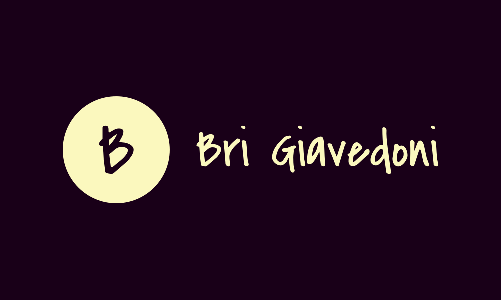

# Portfolio Web | Brisa Giavedoni

Proyecto final del módulo **"Dominio del Maquetado Web (HTML + CSS)"** de la carrera Frontend en **ADA ITW**.

 
  
  [Explora el Portfolio](https://portfolio-brisa-giavedoni.netlify.app/) | [💻 Ver en GitHub](https://github.com/BrisaGiavedoni/Portafolio)

---

## 📑 Tabla de Contenidos

- [Acerca del Proyecto](#acerca-del-proyecto)
- [Estructura del Proyecto](#estructura-del-proyecto)
- [Contenido del Sitio](#contenido-del-sitio)
- [Diseño y Estética](#diseño-y-estética)
- [Objetivos](#objetivos)
- [Contacto](#contacto)

---

## 📌 Acerca del Proyecto

Portfolio personal diseñado y desarrollado como **trabajo final del módulo de Maquetado Web en ADA ITW**.  
Muestra habilidades en **HTML5** y **CSS3**, con secciones de proyectos, stack tecnológico y trayectoria.  

El diseño es **responsive** y funcional en cualquier dispositivo.

---

## 🗂️ Estructura del Proyecto

- `index.html`: Archivo principal del sitio.  
- Carpeta `styles/`: Contiene archivos CSS modularizados.  
- Carpeta `img/`: Recursos gráficos e imágenes.  

---

## 📄 Contenido del Sitio

- **Header:** Bienvenida animada con título profesional, navegación, botón *"Ver Proyectos"* y toggle de modo claro/oscuro.  
- **Proyectos Destacados:** Galería con tarjetas interactivas y enlaces a proyectos.  
- **Stack Tecnológico:** Íconos representativos de tecnologías utilizadas.  
- **Sobre Mí:** Resumen personal y profesional.  
- **Contacto:** Formulario funcional y enlaces a redes sociales.  

---

## 🎨 Diseño y Estética

- **Paleta:** Oscura con degradado vertical y tonos violetas/celestes.  
- **Tipografía:** Fuentes personalizadas desde Google Fonts.  
- **Responsive Design:** Adaptación con media queries.  
- **UX:** Animaciones y toggle claro/oscuro para mejor experiencia.  

---

## 🎯 Objetivos

- Demostrar dominio en **HTML5 y CSS3**.  
- Modularizar CSS para mejorar mantenimiento.  
- Entregar un producto final **profesional y funcional**.  
- Seguir buenas prácticas de desarrollo web.  

---

## 📬 Contacto

Si deseas contactarme:  

- 🌟 [GitHub](https://github.com/BrisaGiavedoni)  
- 💼 [LinkedIn](https://www.linkedin.com/in/brisa-giavedoni/)  
- 📧 **giavedonibrisa@gmail.com**

---
