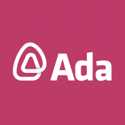
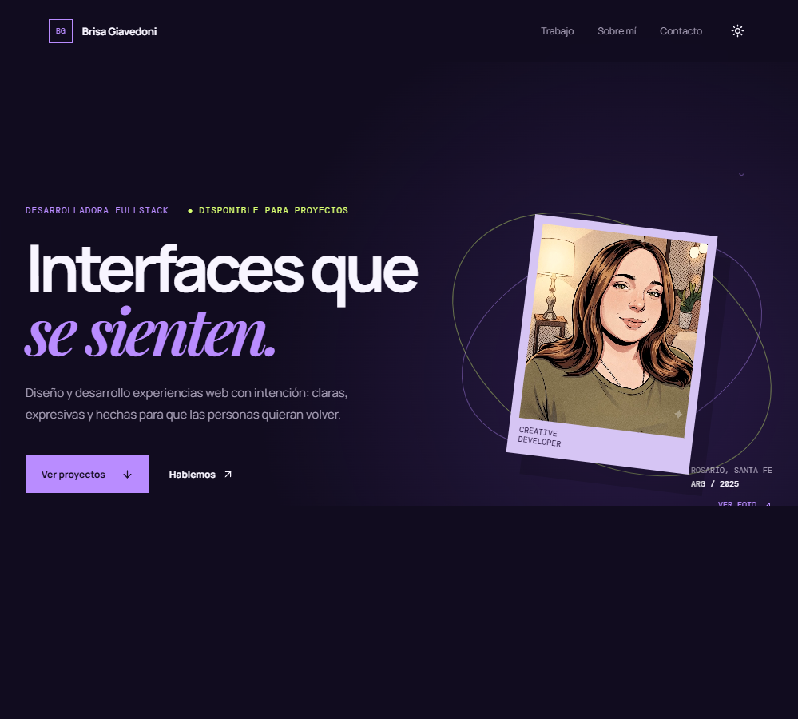
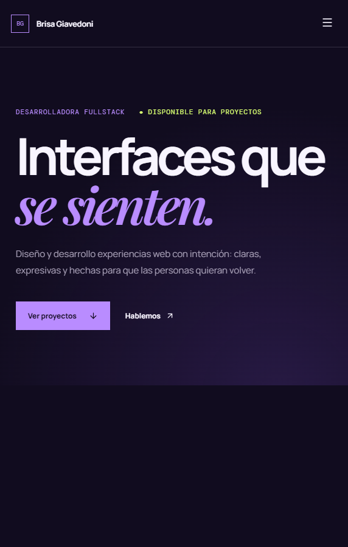
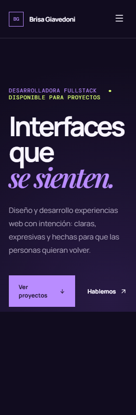

# Portfolio Web | Brisa Giavedoni

Portfolio personal de **Brisa Giavedoni**, desarrolladora web Full Stack formada en **ADA ITW**.

[Explora el Portfolio](https://brisagiavedoni.github.io/Mi-Portfolio/) | [💻 Ver en GitHub](https://github.com/BrisaGiavedoni/Mi-Portfolio)

---

## 📑 Tabla de Contenidos

- [Acerca del Proyecto](#acerca-del-proyecto)
- [Estructura del Proyecto](#estructura-del-proyecto)
- [Contenido del Sitio](#contenido-del-sitio)
- [Objetivos](#objetivos)
- [Contacto](#contacto)

---

## Acerca del Proyecto

Portfolio personal diseñado y desarrollado con **React, Vite y JavaScript**.

Muestra proyectos web, stack tecnológico, experiencia profesional y un formulario de contacto.

El diseño es **responsive** y funcional en cualquier dispositivo.

---

## Estructura del Proyecto

- `src/main.jsx`: Componentes, contenido y comportamiento de la aplicación.
- `src/styles.css`: Sistema visual responsive y animaciones.
- `img/`: Capturas, iconos, retratos y CV ATS descargable.

---

## Contenido del Sitio

- **Hero:** Lluvia de código, retrato con modo cómic, navegación y cambio de tema.
- **Proyectos:** Galería filtrable con tarjetas interactivas y enlaces a proyectos.
- **Stack Tecnológico:** Tarjetas animadas con tecnologías utilizadas.
- **Sobre Mí:** Resumen personal y profesional.
- **Contacto:** Formulario funcional y enlaces a redes sociales.

---

## Objetivos

- Presentar proyectos y experiencia de forma clara para recruiters.
- Mantener una experiencia responsive, accesible y performante.
- Entregar un producto final **profesional y funcional**.
- Seguir buenas prácticas de desarrollo web.

## Vistas responsive

### Desktop

### Tablet

### Mobile

---

## Contacto

Si deseas contactarme:

- 🌟 [GitHub](https://github.com/BrisaGiavedoni)
- 💼 [LinkedIn](https://www.linkedin.com/in/brisa-giavedoni/)
- 📧 **giavedonibrisa@gmail.com**
